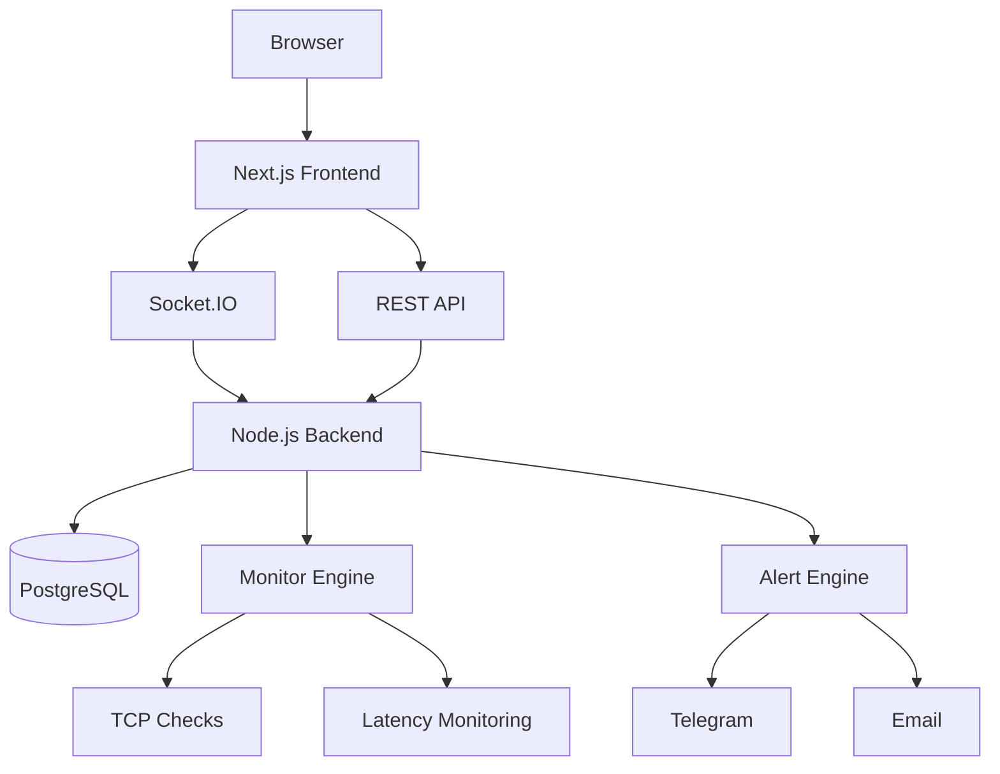

# 🛰️ OrbNOC

<div align="center">


# Enterprise Network Operations Center Platform

### Monitoramento de infraestrutura, disponibilidade e desempenho em tempo real

[]()
[]()
[]()
[]()
[]()
[]()

### 🖥️ Projeto configurado para rodar 100% localmente

</div>

---

## 📋 Índice

* Sobre
* Principais Recursos
* Screenshots
* Arquitetura
* Stack Tecnológica
* Rodando Localmente
* Roadmap
* Licença

---

# 📖 Sobre o Projeto

O **OrbNOC** é uma plataforma moderna de **Network Operations Center (NOC)** desenvolvida para monitoramento contínuo de infraestrutura de rede, servidores e serviços críticos.

Projetado para provedores de internet, equipes de operações, MSPs e administradores de sistemas, o OrbNOC fornece uma visão centralizada da saúde operacional do ambiente através de dashboards em tempo real, alertas inteligentes e ferramentas avançadas de diagnóstico.

### Principais Benefícios

✅ Monitoramento em tempo real

✅ Alertas automatizados

✅ Diagnóstico integrado

✅ Dashboard operacional moderno

✅ Wallboard para NOC

✅ Arquitetura escalável

---

# ✨ Principais Recursos

## 📡 Monitoramento

* Disponibilidade de Hosts (ICMP + fallback TCP)
* Monitoramento de Portas
* Latência
* Jitter
* Packet Loss
* SLA
* Uptime

## 🔔 Sistema de Alertas

* Alertas em tempo real
* Integração Telegram
* Histórico de incidentes
* Reconhecimento de alertas
* Escalonamento de criticidade

## 📊 Dashboard Operacional

* KPIs em tempo real
* Gráficos interativos
* Filtros avançados
* Busca instantânea
* Ordenação dinâmica
* Atualização WebSocket

## 🗺️ Topologia de Rede

* React Flow
* Layout Hierárquico
* Layout Radial
* Layout Grid
* Status visual dos dispositivos
* Links animados

## 🔧 Ferramentas de Diagnóstico

* Ping Avançado
* Traceroute
* DNS Lookup
* TCP Port Scanner
* Diagnóstico Inteligente

## 📺 Wallboard

* Modo TV
* Atualização automática
* Visualização otimizada para NOC
* Exibição de incidentes críticos

---

# 📸 Screenshots

## Dashboard Principal


## Centro de Alertas


## Mapa de Rede


---

# 🏗️ Arquitetura



---

# ⚙️ Stack Tecnológica

## Frontend

* Next.js 14
* React 18
* TypeScript
* Tailwind CSS
* Recharts
* React Flow
* Socket.IO Client

## Backend

* Node.js
* Express
* Prisma ORM
* Socket.IO
* JWT Authentication

## Banco de Dados

* PostgreSQL
* Prisma Migrations

## Infraestrutura

* Docker / Docker Compose (local)

---

# 🚀 Rodando Localmente

## Pré-requisitos

* [Docker Desktop](https://www.docker.com/products/docker-desktop/) instalado e rodando (para a Opção 1)
* Ou, para rodar sem Docker: Node.js 20+ e PostgreSQL instalados localmente

## Opção 1 — Docker Compose (recomendado, sobe tudo com 1 comando)

Sobe o PostgreSQL, o backend e o frontend juntos, já configurados para se falarem via `localhost`. As tabelas do banco e um usuário de demonstração são criados automaticamente na primeira inicialização.

```bash
docker compose up --build
```

Acesse:

* **Frontend:** http://localhost:3000
* **Backend API:** http://localhost:3001
* **PostgreSQL:** localhost:5433 (usuário `postgres`, senha `postgres`, banco `orbnoc`)

**Login de demonstração** (criado automaticamente):

```
usuário: admin
senha:   admin123
```

Para parar:

```bash
docker compose down
```

Para parar **e apagar os dados do banco** (útil se algo ficou inconsistente e você quer recomeçar do zero):

```bash
docker compose down -v
```

### Problemas comuns

| Sintoma | Causa provável | Solução |
| --- | --- | --- |
| `Conflict. The container name "/orbnoc-db" is already in use` | Sobrou container de uma execução anterior | `docker compose down` e rode `up --build` de novo |
| Erro 500 ao logar / `relation "..." does not exist` nos logs | Backend subiu antes do Postgres estar pronto | Já tratado via healthcheck + retry automático; se persistir, rode `docker compose down -v` para recriar o banco do zero |
| Falha ao baixar imagens (`no such host`, `registry-1.docker.io`) | Problema de DNS/rede do Docker Desktop | Reinicie o Docker Desktop, ou configure DNS manual (8.8.8.8 / 1.1.1.1) em *Settings → Docker Engine* |

## Opção 2 — Rodando manualmente (sem Docker)

### Backend

```bash
cd backend

npm install

cp ../.env.example .env
# edite o .env e ajuste DATABASE_URL para o seu PostgreSQL local

npm run dev
```

### Frontend

```bash
cd frontend

npm install

npm run dev
```

Por padrão o frontend já aponta para `http://localhost:3001` (backend local), sem precisar configurar nada — mas se quiser ser explícito, crie um `.env.local` em `frontend/` com:

```
NEXT_PUBLIC_API_URL=http://localhost:3001
```

---

# 🛣️ Roadmap

* [x] Dashboard Operacional
* [x] Alertas Telegram
* [x] Topologia de Rede
* [x] Diagnóstico Integrado
* [x] Wallboard

### Próximas Funcionalidades

* [ ] Multi-Tenant
* [ ] SNMP Monitoring
* [ ] NetFlow
* [ ] Syslog Server
* [ ] Mobile App
* [ ] Dark/Light Themes

---

# 🤝 Contribuição

Contribuições são bem-vindas.

1. Fork o projeto
2. Crie uma branch
3. Faça commit das alterações
4. Abra um Pull Request

---

# 📄 Licença

Distribuído sob a licença MIT.

---

<div align="center">

### Desenvolvido por Adan William

Network Monitoring • NOC • Observability • Infrastructure

</div>
