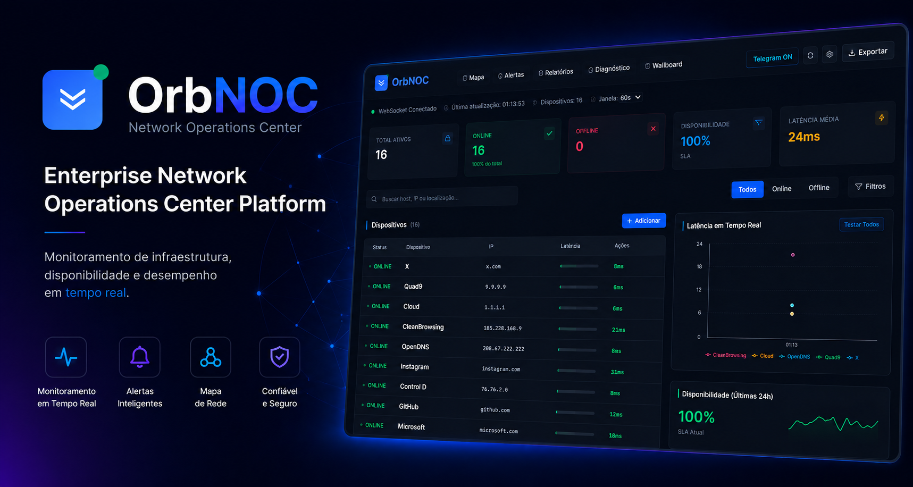
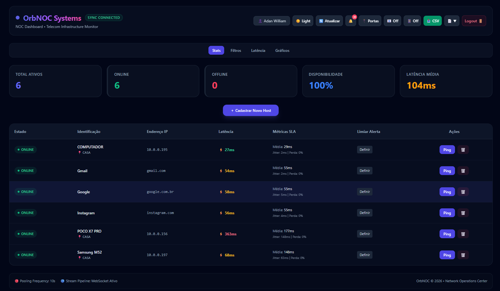
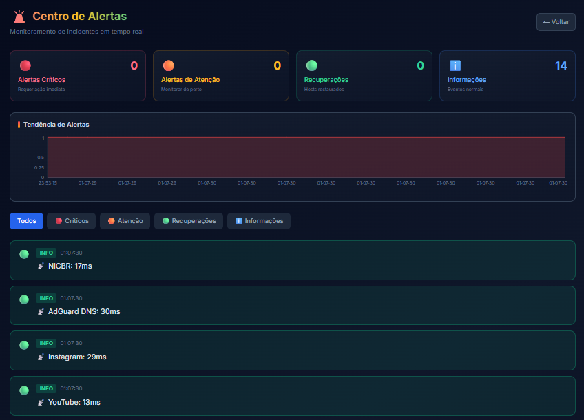
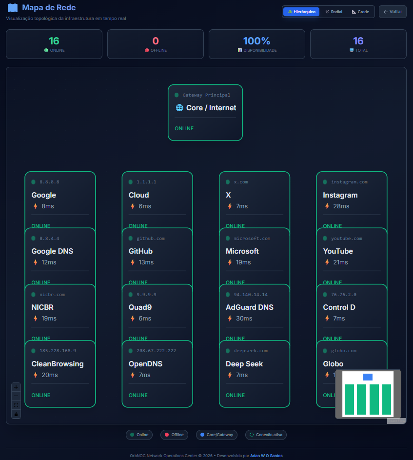
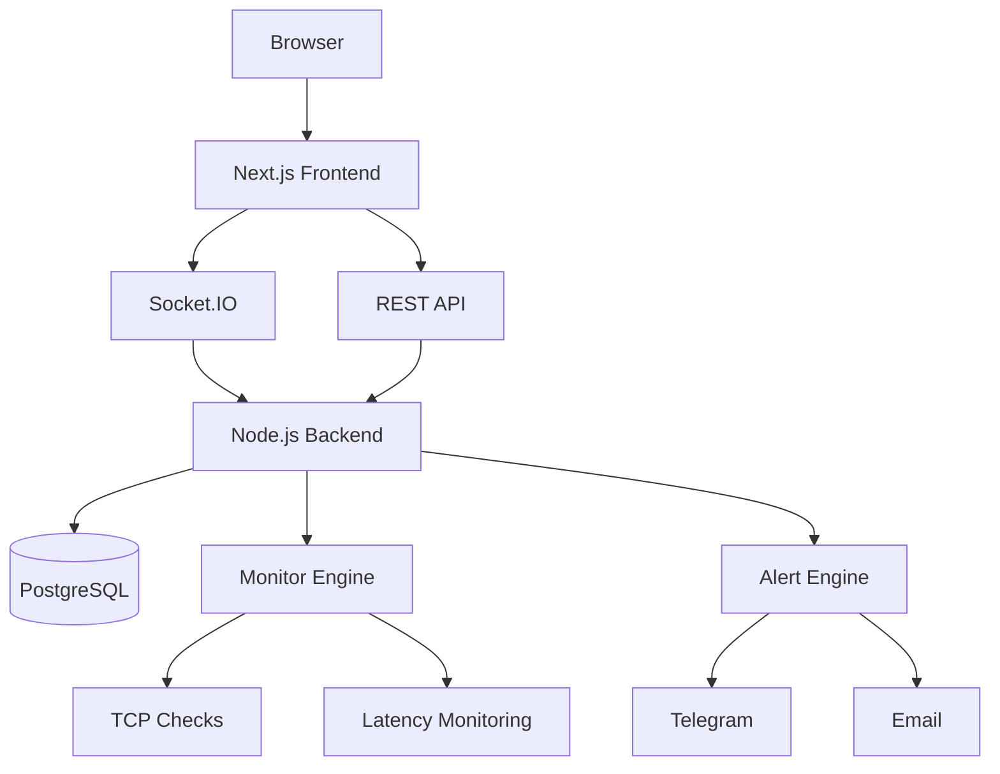

# 🛰️ OrbNOC

<div align="center">



# Enterprise Network Operations Center Platform

### Monitoramento de infraestrutura, disponibilidade e desempenho em tempo real

[]()
[]()
[]()
[]()
[]()
[]()

### 🚀 Live Demo

| Ambiente    | URL                                      |
| ----------- | ---------------------------------------- |
| Frontend    | https://orbnoc-taer.onrender.com         |
| Backend API | https://orbnoc-backend-nmlq.onrender.com |

</div>

---

## 📋 Índice

* Sobre
* Principais Recursos
* Screenshots
* Arquitetura
* Stack Tecnológica
* Instalação
* Roadmap
* Licença

---

# 📖 Sobre o Projeto

O **OrbNOC** é uma plataforma moderna de **Network Operations Center (NOC)** desenvolvida para monitoramento contínuo de infraestrutura de rede, servidores e serviços críticos.

Projetado para provedores de internet, equipes de operações, MSPs e administradores de sistemas, o OrbNOC fornece uma visão centralizada da saúde operacional do ambiente através de dashboards em tempo real, alertas inteligentes e ferramentas avançadas de diagnóstico.

### Principais Benefícios

✅ Monitoramento em tempo real

✅ Alertas automatizados

✅ Diagnóstico integrado

✅ Dashboard operacional moderno

✅ Wallboard para NOC

✅ Arquitetura escalável

---

# ✨ Principais Recursos

## 📡 Monitoramento

* Disponibilidade de Hosts
* TCP Connectivity Checks
* Monitoramento de Portas
* Latência
* Jitter
* Packet Loss
* SLA
* Uptime

## 🔔 Sistema de Alertas

* Alertas em tempo real
* Integração Telegram
* Histórico de incidentes
* Reconhecimento de alertas
* Escalonamento de criticidade

## 📊 Dashboard Operacional

* KPIs em tempo real
* Gráficos interativos
* Filtros avançados
* Busca instantânea
* Ordenação dinâmica
* Atualização WebSocket

## 🗺️ Topologia de Rede

* React Flow
* Layout Hierárquico
* Layout Radial
* Layout Grid
* Status visual dos dispositivos
* Links animados

## 🔧 Ferramentas de Diagnóstico

* Ping Avançado
* Traceroute
* DNS Lookup
* TCP Port Scanner
* Diagnóstico Inteligente

## 📺 Wallboard

* Modo TV
* Atualização automática
* Visualização otimizada para NOC
* Exibição de incidentes críticos

---

# 📸 Screenshots

## Dashboard Principal



## Centro de Alertas



## Mapa de Rede



---

# 🏗️ Arquitetura



---

# ⚙️ Stack Tecnológica

## Frontend

* Next.js 14
* React 18
* TypeScript
* Tailwind CSS
* Recharts
* React Flow
* Socket.IO Client

## Backend

* Node.js
* Express
* Prisma ORM
* Socket.IO
* JWT Authentication

## Banco de Dados

* PostgreSQL
* Prisma Migrations

## Infraestrutura

* Render
* GitHub Actions
* Docker (Roadmap)

---

# 🚀 Instalação

## Clonar Projeto

```bash
git clone https://github.com/seuusuario/orbnoc.git

cd orbnoc
```

## Backend

```bash
cd backend

npm install

npm run dev
```

## Frontend

```bash
cd frontend

npm install

npm run dev
```

---

# 🛣️ Roadmap

* [x] Dashboard Operacional
* [x] Alertas Telegram
* [x] Topologia de Rede
* [x] Diagnóstico Integrado
* [x] Wallboard

### Próximas Funcionalidades

* [ ] Multi-Tenant
* [ ] SNMP Monitoring
* [ ] NetFlow
* [ ] Syslog Server
* [ ] Docker Deployment
* [ ] Kubernetes Deployment
* [ ] Mobile App
* [ ] Dark/Light Themes

---

# 🤝 Contribuição

Contribuições são bem-vindas.

1. Fork o projeto
2. Crie uma branch
3. Faça commit das alterações
4. Abra um Pull Request

---

# 📄 Licença

Distribuído sob a licença MIT.

---

<div align="center">

### Desenvolvido por Adan William

Network Monitoring • NOC • Observability • Infrastructure

</div>
