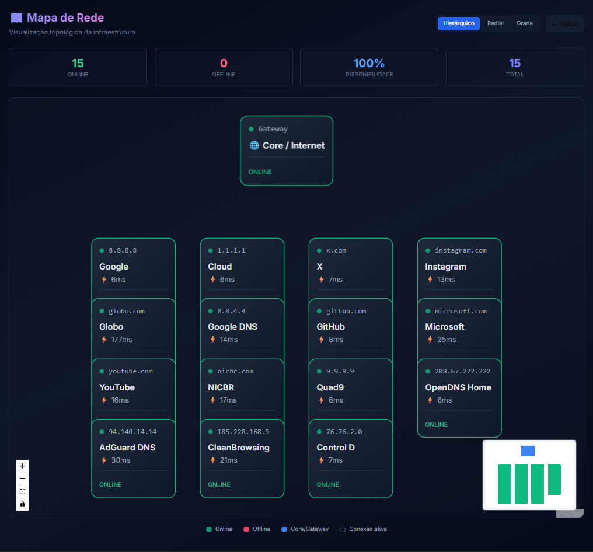
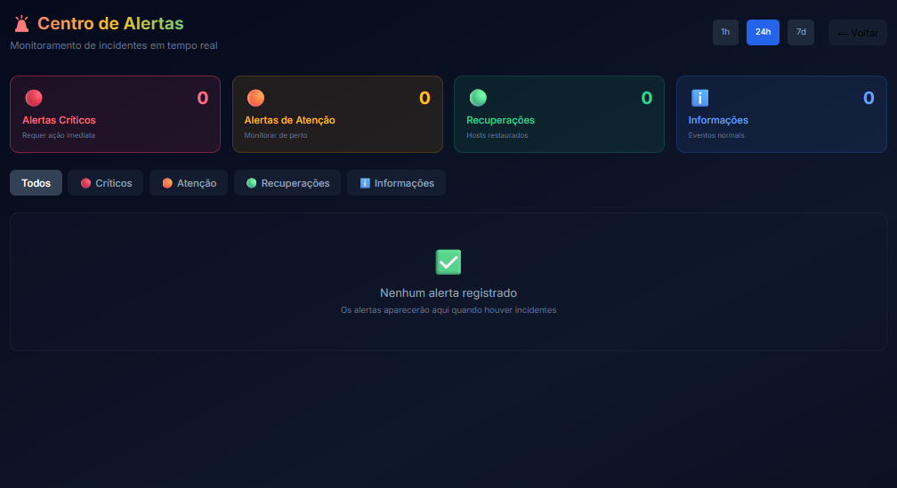
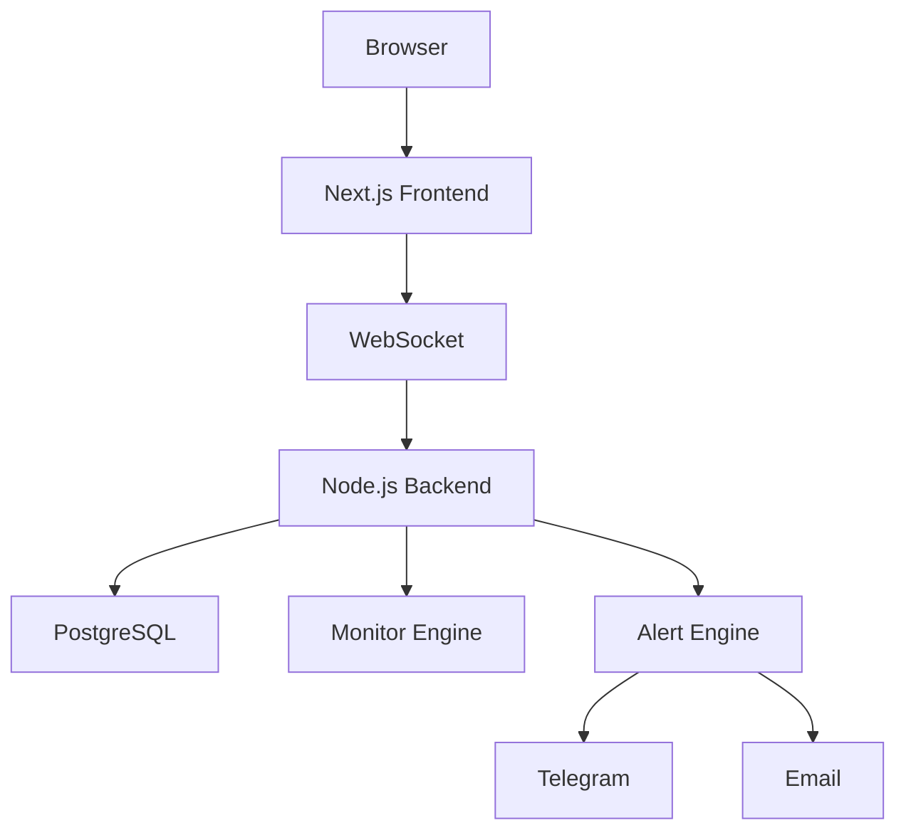

# 🛰️ OrbNOC

<div align="center">

# Enterprise Network Operations Center Platform

Monitoramento de infraestrutura, disponibilidade e desempenho em tempo real.


### 🌐 Acesso Online

**Frontend:** https://orbnoc-taer.onrender.com

**API:** https://orbnoc-backend-nmlq.onrender.com

</div>

---

## 📖 Sobre

O OrbNOC é uma plataforma moderna para monitoramento de infraestrutura desenvolvida para equipes de NOC, provedores de internet e profissionais de TI.

A solução oferece monitoramento contínuo, visualização em tempo real, geração de alertas inteligentes e análise operacional através de dashboards interativos.

---

## ✨ Principais Funcionalidades

### 📡 Monitoramento

* Disponibilidade de Hosts
* TCP Connect Monitoring
* Latência
* Jitter
* Packet Loss
* Uptime
* SLA

### 🔔 Sistema de Alertas

* Alertas em Tempo Real
* Integração Telegram
* Integração Email
* Histórico de Incidentes
* Reconhecimento de Alertas

### 📊 Dashboard Operacional

* KPIs Executivos
* Gráficos Interativos
* Filtros Avançados
* Busca por IP ou Host
* Atualização via WebSocket

### 🗺️ Mapa de Rede

* React Flow
* Layout Hierárquico
* Layout Radial
* Layout em Grade
* Topologia Visual

### 📈 Relatórios

* Exportação PDF
* Exportação Excel
* Histórico de Disponibilidade
* Tendência de Latência
* Filtros por Período

---

## 🖼️ Screenshots

### Dashboard Principal


### Mapa de Rede



### Centro de Alertas



---

## 🏗️ Arquitetura



## 🛠️ Stack Tecnológica

### Frontend

* Next.js 14
* React
* TailwindCSS
* Socket.IO Client
* React Flow
* Recharts
* jsPDF
* SheetJS

### Backend

* Node.js
* Express.js
* Socket.IO
* JWT
* bcrypt
* node-cron

### Banco de Dados

* PostgreSQL
* SQLite

### DevOps

* Docker
* Docker Compose
* GitHub Actions
* Render

---

## 📁 Estrutura do Projeto

```text
OrbNOC
├── backend
├── frontend
├── docs
├── docker-compose.yml
└── README.md
```

---

## 🔐 Credenciais Demo

```text
Usuário: admin
Senha: admin123
```

---

## 🚀 Instalação

### Backend

```bash
cd backend
npm install
npm start
```

### Frontend

```bash
cd frontend
npm install
npm run dev
```

---

## ⚙️ Variáveis de Ambiente

### Backend

```env
DATABASE_URL=
JWT_SECRET=

TELEGRAM_BOT_TOKEN=
TELEGRAM_CHAT_ID=

SMTP_HOST=
SMTP_USER=
SMTP_PASSWORD=
```

### Frontend

```env
NEXT_PUBLIC_API_URL=
NEXT_PUBLIC_WS_URL=
```

---

## 📌 Roadmap

### v2.1

* ✅ Dashboard em Tempo Real
* ✅ Centro de Alertas
* ✅ Mapa de Rede
* ✅ Relatórios Avançados

### v2.5

* 🚧 SLA por Cliente
* 🚧 Wallboard NOC
* 🚧 Monitoramento de Portas

### v3.0

* 🔮 AI Incident Analysis
* 🔮 Root Cause Analysis
* 🔮 Predictive Monitoring
* 🔮 Multi-Tenant

---

## 📊 Status

| Módulo      | Status |
| ----------- | ------ |
| Dashboard   | ✅      |
| WebSocket   | ✅      |
| Alertas     | ✅      |
| Relatórios  | ✅      |
| JWT Auth    | ✅      |
| Network Map | ✅      |
| Deploy      | ✅      |

---

## 🤝 Contribuição

```bash
git checkout -b feature/minha-feature
git commit -m "feat: nova funcionalidade"
git push origin feature/minha-feature
```

---

## 📄 Licença

MIT License

---

<div align="center">

### Desenvolvido por Adan W. O. Santos

OrbNOC Platform

Infrastructure Monitoring • Network Operations Center • Real-Time Analytics

© 2026 OrbNOC

</div>
